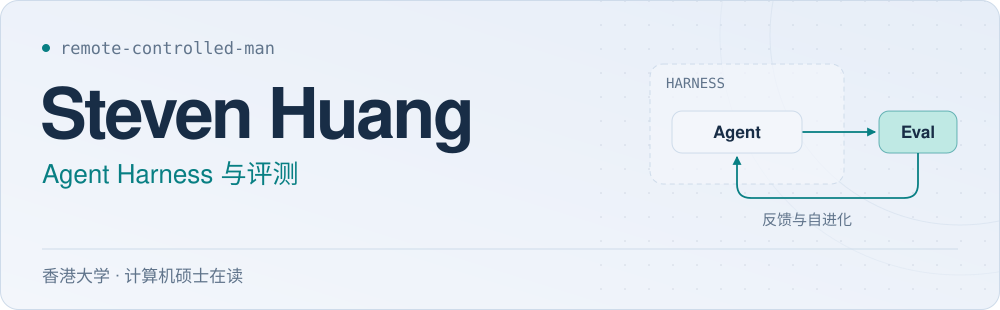

<picture><source media="(prefers-color-scheme: dark) and (max-width: 900px)" srcset="./assets/hero-harness-zh-mobile-dark-v3.svg"><source media="(max-width: 900px)" srcset="./assets/hero-harness-zh-mobile-light-v3.svg"><source media="(prefers-color-scheme: dark)" srcset="./assets/hero-harness-zh-dark-v3.svg"></picture>

  <a href="./README.md"><picture><source media="(prefers-color-scheme: dark)" srcset="./assets/button-nav-language-zh-dark-v2.svg"></picture></a>&nbsp;&nbsp;<a href="#user-content-项目"><picture><source media="(prefers-color-scheme: dark)" srcset="./assets/button-nav-projects-zh-dark-v2.svg"></picture></a>
  <a href="#user-content-开源贡献"><picture><source media="(prefers-color-scheme: dark)" srcset="./assets/button-nav-contributions-zh-dark-v2.svg"></picture></a>&nbsp;&nbsp;<a href="https://www.linkedin.com/in/steven-sidi-huang/"><picture><source media="(prefers-color-scheme: dark)" srcset="./assets/button-nav-linkedin-zh-dark-v2.svg"></picture></a>

我在香港大学读计算机硕士，目前在[蚂蚁集团](https://www.antgroup.com/)实习，做 AI + 量化。我负责让 Agent 从已有因子生成策略、跑回测，最近也在研究让它根据回测反馈挖掘新的因子。之前在[细胞壁（Cybopal）](https://cybopal.com/)做 Agent 评测、Harness 和全双工多模态交互研究，也在[快手](https://www.kuaishou.com/)实习过。

## 项目

<h3><a href="https://github.com/remote-controlled-man/skillfit">skillfit ↗</a></h3>

<strong>评测 Coding Agent 配置的实际效果</strong>

我在开发的命令行评测工具，用相同任务的配对实验，比较 Skill、规则文件和 MCP 配置带来的质量、触发率与成本变化。保留校验结果和不确定性，方便检查每一次比较的依据。

<a href="https://github.com/remote-controlled-man/skillfit/blob/main/benches/contrib/oss-mcp-use-utf8/README.md"><picture><source media="(prefers-color-scheme: dark)" srcset="./assets/button-case-zh-dark-v2.svg"></picture></a>&nbsp;&nbsp;<a href="https://github.com/remote-controlled-man/skillfit/blob/main/docs/metrics.md"><picture><source media="(prefers-color-scheme: dark)" srcset="./assets/button-protocol-zh-dark-v2.svg"></picture></a>

早期阅读笔记：<a href="https://remote-controlled-man.github.io/agent-context-memory-guide/">Agent Context &amp; Memory Guide ↗</a> · 六个 Agent 系统的上下文与记忆机制。

## 开源贡献

**21 个已合并 PR · 8 个上游项目** &nbsp; 截至 2026-10-03

| 精选项目 | PR | 代表贡献 |
| :--- | :---: | :--- |
| [AxonHub](https://github.com/looplj/axonhub)  LLM API 网关 | [9](https://github.com/looplj/axonhub/pulls?q=is%3Apr+is%3Amerged+author%3Aremote-controlled-man) | 修复 API 转换中工具调用限制和流式字段丢失的问题。 [#2561](https://github.com/looplj/axonhub/pull/2561) |
| [AgentField](https://github.com/Agent-Field/agentfield)  Agent 后端框架 | [4](https://github.com/Agent-Field/agentfield/pulls?q=is%3Apr+is%3Amerged+author%3Aremote-controlled-man) | 增加 TypeScript Harness 的 Provider 预检；修复 Python SDK 的配置解析与随机状态隔离。 [#1069](https://github.com/Agent-Field/agentfield/pull/1069) |
| [MCP-Use](https://github.com/mcp-use/mcp-use)  MCP 应用框架 | [1](https://github.com/mcp-use/mcp-use/pulls?q=is%3Apr+is%3Amerged+author%3Aremote-controlled-man) | 修复客户端 HTML 资源的 UTF-8 解码，让 MCP App 正确显示中文和 Emoji。 [#2632](https://github.com/mcp-use/mcp-use/pull/2632) |
| [CopilotKit](https://github.com/CopilotKit/CopilotKit)  Agent 前端框架 | [1](https://github.com/CopilotKit/CopilotKit/pulls?q=is%3Apr+is%3Amerged+author%3Aremote-controlled-man) | 修复 Runtime 的路由边界判断，避免路径前缀相似的请求被误匹配。 [#7341](https://github.com/CopilotKit/CopilotKit/pull/7341) |
| [GPT&nbsp;Researcher](https://github.com/assafelovic/gpt-researcher)  自主研究 Agent | [2](https://github.com/assafelovic/gpt-researcher/pulls?q=is%3Apr+is%3Amerged+author%3Aremote-controlled-man) | 修复研究上下文合并与空检索结果回退，保留补充检索内容。 [#2104](https://github.com/assafelovic/gpt-researcher/pull/2104) |
| [DeepTutor](https://github.com/HKUDS/DeepTutor)  个性化 AI 学习助手 | [1](https://github.com/HKUDS/DeepTutor/pulls?q=is%3Apr+is%3Amerged+author%3Aremote-controlled-man) | 修复模型适配中的视觉能力识别，支持带资源前缀的 Gemini 模型 ID。 [#1588](https://github.com/HKUDS/DeepTutor/pull/1588) |
| [PR-Agent](https://github.com/The-PR-Agent/pr-agent)  AI 代码审查工具 | [1](https://github.com/The-PR-Agent/pr-agent/pulls?q=is%3Apr+is%3Amerged+author%3Aremote-controlled-man) | 完善 GitHub 更新日志发布，支持在目标文件缺失时自动创建。 [#3639](https://github.com/The-PR-Agent/pr-agent/pull/3639) |

展开全部 21 个已合并 PR · 8 个项目

统计核实于 2026-10-03。上表 Star 为上游仓库的动态计数。

**[AgentField](https://github.com/Agent-Field/agentfield) · 4 个 PR**

- [#1082](https://github.com/Agent-Field/agentfield/pull/1082) — 统一 AGENTFIELD_ASYNC 布尔环境变量的解析规则。
- [#1078](https://github.com/Agent-Field/agentfield/pull/1078) — 避免限流器的随机抖动影响全局随机数状态。
- [#1072](https://github.com/Agent-Field/agentfield/pull/1072) — 在不使用 Schema 的 Harness 运行中跳过 Schema 输出目录。
- [#1069](https://github.com/Agent-Field/agentfield/pull/1069) — 为 TypeScript Agent Harness 增加运行前的 Provider 可用性检查。

**[AxonHub](https://github.com/looplj/axonhub) · 9 个 PR**

- [#2572](https://github.com/looplj/axonhub/pull/2572) — 将聚合后的引用信息放入响应顶层字段，避免泄露内部转换元数据。
- [#2561](https://github.com/looplj/axonhub/pull/2561) — 聚合聊天流时保留拒绝回答、音频、logprobs 和推理字段。
- [#2519](https://github.com/looplj/axonhub/pull/2519) — 在 Chat Completions 请求转发中保留允许调用的工具范围。
- [#2517](https://github.com/looplj/axonhub/pull/2517) — 修复配置弹窗内模板浮层无法滚动的问题。
- [#2501](https://github.com/looplj/axonhub/pull/2501) — 保留上游服务要求的 User-Agent 请求头。
- [#2499](https://github.com/looplj/axonhub/pull/2499) — 应用 set_if_absent 请求体覆盖规则时使用原始入站请求体。
- [#2484](https://github.com/looplj/axonhub/pull/2484) — 修正内嵌测试数据的文件系统路径。
- [#2423](https://github.com/looplj/axonhub/pull/2423) — 在 Anthropic 请求处理中保留 DeepSeek 原生网页搜索工具。
- [#2370](https://github.com/looplj/axonhub/pull/2370) — 让透传模式下的图像编辑接口接受 application/json 请求。

**[MCP-Use](https://github.com/mcp-use/mcp-use) · 1 个 PR**

- [#2632](https://github.com/mcp-use/mcp-use/pull/2632) — 使用 UTF-8 解码 MCP App HTML，让中文和 Emoji 正确显示。

**[CopilotKit](https://github.com/CopilotKit/CopilotKit) · 1 个 PR**

- [#7341](https://github.com/CopilotKit/CopilotKit/pull/7341) — 修复单路由模式下仅路径前缀相同就被错误匹配的问题。

**[GPT Researcher](https://github.com/assafelovic/gpt-researcher) · 2 个 PR**

- [#2105](https://github.com/assafelovic/gpt-researcher/pull/2105) — 在检索内容规范化后为空时启用回退处理。
- [#2104](https://github.com/assafelovic/gpt-researcher/pull/2104) — 合并来源时保留补充网页检索上下文，避免文本被破坏。

**[DeepTutor](https://github.com/HKUDS/DeepTutor) · 1 个 PR**

- [#1588](https://github.com/HKUDS/DeepTutor/pull/1588) — 修复带 models/ 前缀的 Gemini 模型 ID 的视觉能力识别。

**[PR-Agent](https://github.com/The-PR-Agent/pr-agent) · 1 个 PR**

- [#3639](https://github.com/The-PR-Agent/pr-agent/pull/3639) — 发布自动生成的更新日志时，支持创建尚不存在的目标文件。

**[Agent-For-Exam](https://github.com/1firecracker/Agent-For-Exam) · 2 个 PR**

- [#15](https://github.com/1firecracker/Agent-For-Exam/pull/15) — 修复移动端 Teleport 弹窗的全局样式覆盖。
- [#14](https://github.com/1firecracker/Agent-For-Exam/pull/14) — 适配 Android 端的模型设置弹窗和 PPT 触控操作。

[在 GitHub 查看完整记录 →](https://github.com/search?q=is%3Apr+is%3Amerged+author%3Aremote-controlled-man+-user%3Aremote-controlled-man&type=pullrequests)

