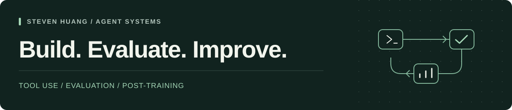

  

  <a href="./README.md">English</a> · <strong>简体中文</strong>

# 你好，我是黄思迪 Steven

**Agent 系统工程 · 智能体评测 · 大模型后训练**

我目前在**香港大学**攻读计算机硕士，关注能调用工具、从失败中改进，并经得起系统评测的 Agent。

我的实践涵盖 Agent Harness、具身工具执行、检索增强和小模型后训练。我希望让执行过程可观测、失败可复现，让每一次改进都有证据支撑。

[GitHub](https://github.com/remote-controlled-man) · [代表项目](#代表项目) · [实习经历](#实习经历) · [English](./README.md)

## 我关注的方向

- **可靠执行**：工具接口约束、上下文与记忆、运行时追踪，以及出错后的恢复机制。
- **有证据的评测**：任务环境、确定性校验、失败分析和受控对比实验。
- **高效适配**：SFT / QLoRA、从失败轨迹构造训练数据，以及大小模型之间的任务路由。

## 代表项目

### [skillfit](https://github.com/remote-controlled-man/skillfit)

**Agent 的配置有没有用，让实验来回答。**

一个开源命令行工具，用真实任务评估 Skills、规则文件和 MCP 配置的效果。通过基线与实验组配对运行、结果校验和统计分析，报告质量、成本与不确定性；也衡量 Agent 是否真正触发了已安装的 Skill。

`TypeScript` `Agent 评测` `MCP` `配对实验`

### DeviceAgent Arena

**围绕多步任务与故障恢复，训练和评测工具调用能力。**

个人项目：搭建任务环境与故障注入机制，同时根据最终状态和执行轨迹判分。使用 QLoRA 微调 Qwen3-1.7B，并让 FunctionGemma-270M 处理规则明确的步骤，校验失败时交给 Qwen 处理。

在 **36 个未参与训练或修复的留出任务**上，严格成功数从 **22/36 提升至 31/36**，Qwen 调用减少 **34.1%**，P95 延迟降低 **17.6%**；安全执行通过数保持 **34/36**。这些结果对应这一任务集。

`工具调用` `QLoRA` `失败分析` `模型路由`

### ExamPilot

**让课程助教的每个有据回答，都能回到原文页码。**

个人 Agentic RAG 项目：使用 LangGraph 与 LightRAG 编排课程资料检索和工具调用，融合向量检索与知识图谱，将证据映射回文档页码，并以流式事件展示检索、工具调用和生成过程，便于观察与回放。

`LangGraph` `LightRAG` `页级引用` `RAG`

### [Agent Context & Memory Guide](https://github.com/remote-controlled-man/agent-context-memory-guide)

**从源码出发，理解 Agent 如何组织上下文、保存记忆。**

一套中文学习资料，通过源码阅读对比六个 Agent 项目的实现，提供代码位置参考和配套学习站，梳理历史记录、摘要压缩、检索与持久记忆之间的关系。

`上下文工程` `记忆系统` `源码阅读`

## 实习经历

| 团队 | 岗位 | 主要方向 |
| :--- | :--- | :--- |
| **蚂蚁集团** · 2026.07–至今 | 智能体优化算法实习生 | 策略生成与评测闭环、Verifier、可复现的 Agent 实验 |
| **细胞壁科技 / Cybopal** · 2026.03–06 | Agent 算法实习生 | 具身工具执行、机械臂 MCP 接入、语音指令 Agent 与故障恢复 |
| **快手** · 2024.08–11 | 后端开发实习生 | 异步数据处理、多媒体自动化评测流程 |

## 常用技术

**工程开发** — Python、TypeScript、Rust、Asyncio、FastAPI、Tokio、Docker、CI/CD  
**Agent 系统** — MCP、Tool Calling、JSON Schema、Tracing、Context / Memory  
**模型与检索** — SFT、LoRA / QLoRA、LangGraph、LightRAG

## 教育背景

**香港大学** — 计算机硕士在读  
**北京工业大学** — 软件工程学士

---

欢迎交流 Agent 评测、工具调用和开源开发工具。[浏览我的仓库 →](https://github.com/remote-controlled-man?tab=repositories)
